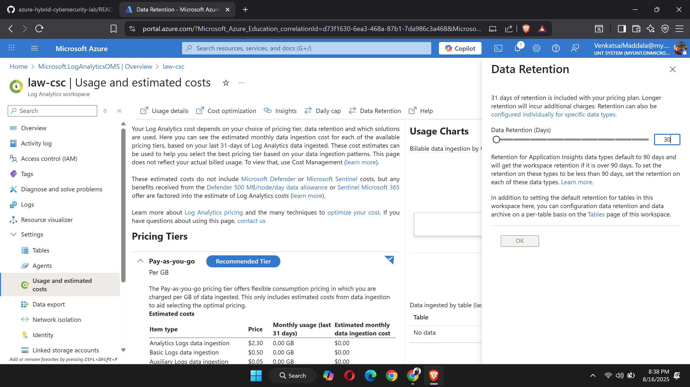
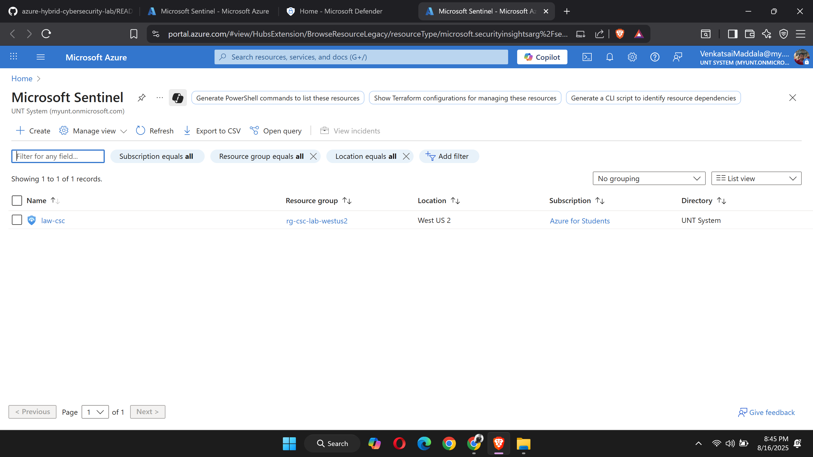
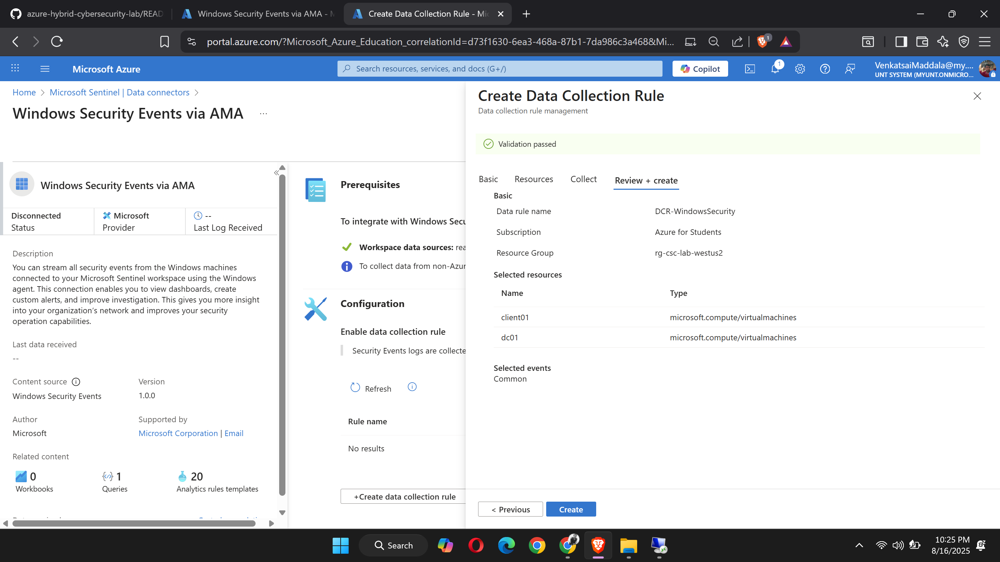
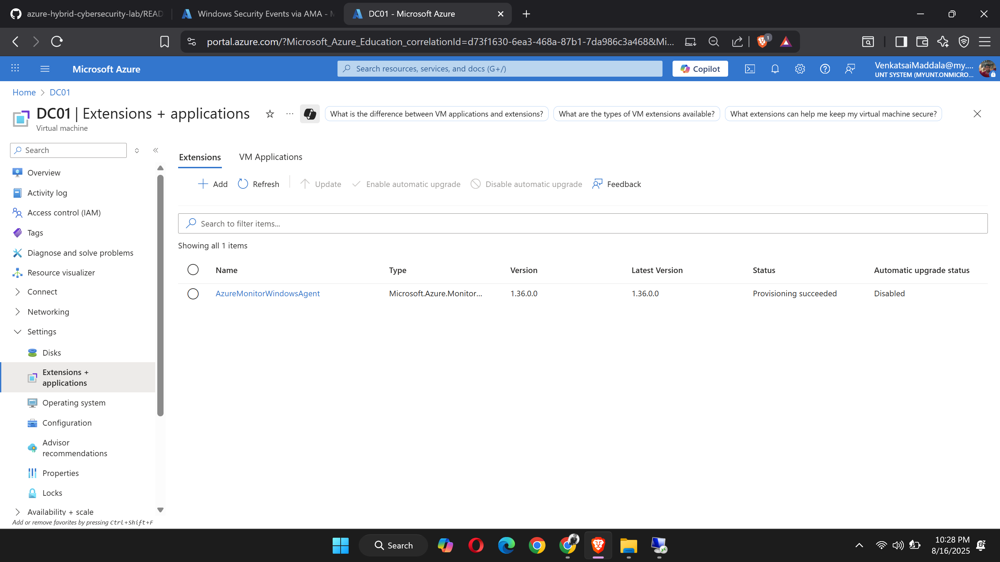
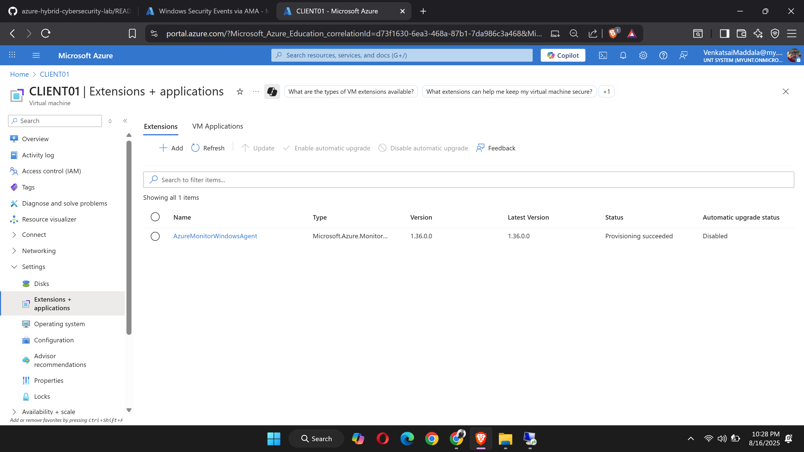
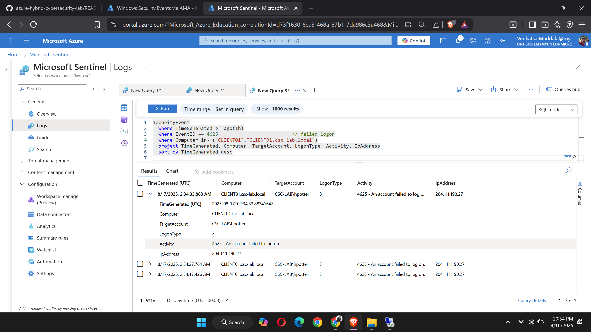
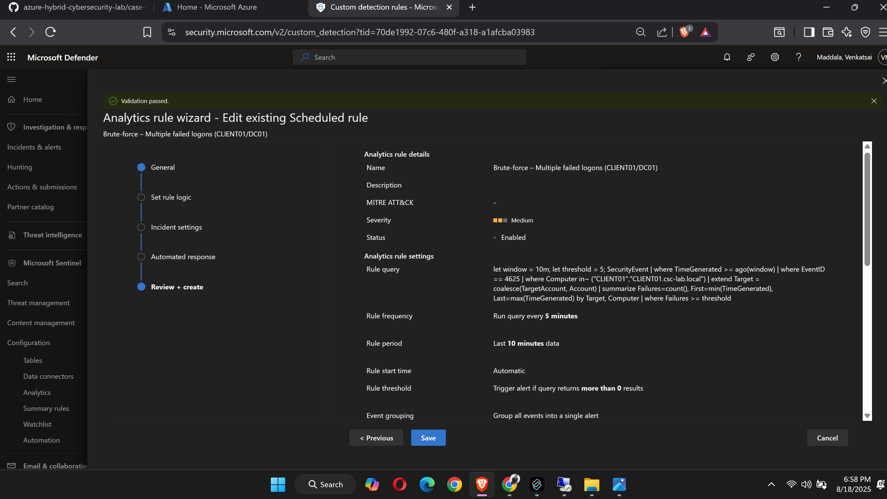
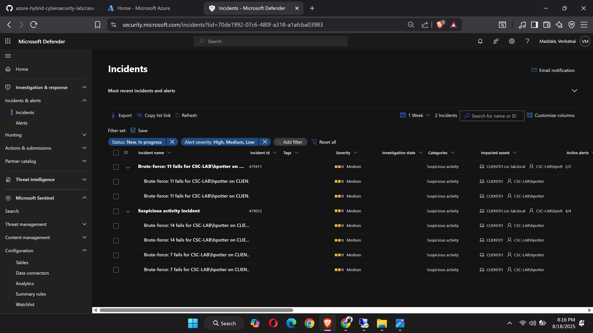
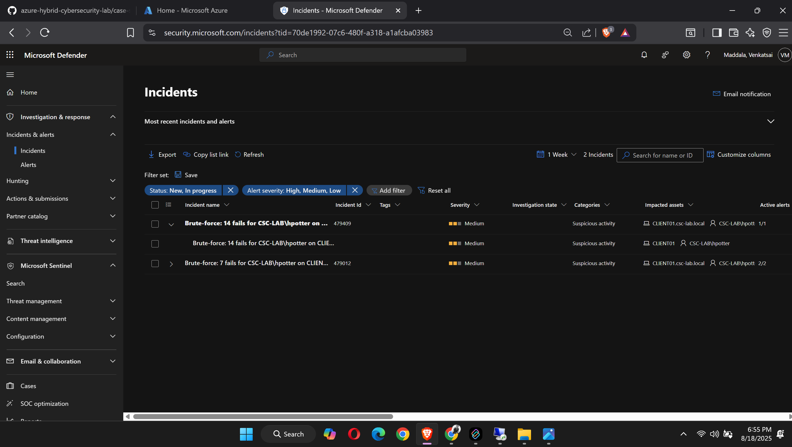
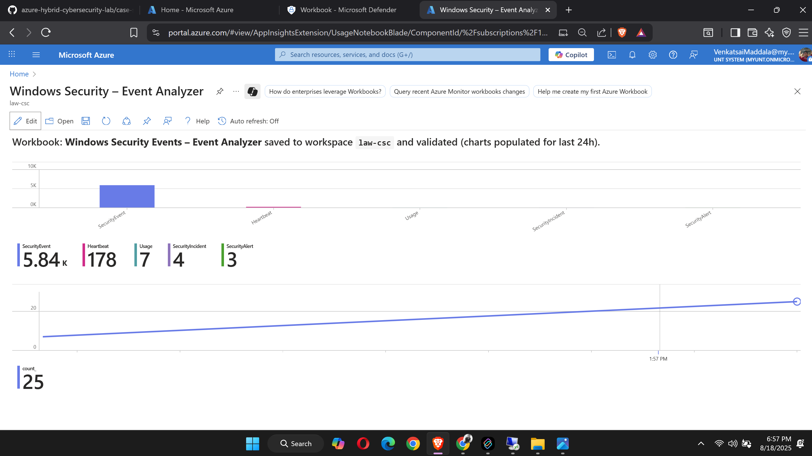

# Microsoft Sentinel — Onboarding (Windows Security Only)

## TL;DR
Enabled **Microsoft Sentinel** on `law-csc`, onboarded **Windows Security Events via AMA** for **DC01** and **CLIENT01**, verified log ingestion with **KQL**, built a **scheduled analytics rule** for **brute-force (≥5 x 4625 in 10m)**, turned on **alert grouping**, confirmed **incidents** in the Defender portal, and saved the **Windows Security – Event Analyzer** workbook.

> **Note:** Entra ID (SignInLogs/AuditLogs) not enabled here due to university tenant permissions (no tenant-admin). See **Limitations**.

---

## Environment
- **Region / RG:** West US 2 / `rg-csc-lab-westus2`  
- **Workspace:** `law-csc` (Log Analytics)  
- **VMs:** `DC01` (Windows Server 2022), `CLIENT01` (Windows 10)  
- **Agent:** Azure Monitor Agent (AMA)  
- **Connector:** Windows Security Events **via AMA** (not legacy MMA)

---

## Objectives
1) Enable Sentinel on `law-csc`.  
2) Collect **SecurityEvent** from DC01 & CLIENT01 via **AMA + DCR**.  
3) Hunt with KQL and confirm 4625 failed logons.  
4) Create a scheduled rule (**≥5 failed logons in 10m**) with **entity mapping** and **alert grouping**.  
5) Save the **Windows Security** workbook and capture evidence.

---

## Implementation (GUI-only)

### 1) Workspace & Sentinel
1. Azure Portal → **Log Analytics workspaces** → verify/create **`law-csc`**.  
2. Set retention (e.g., **30 days**).  
3. Azure Portal → **Microsoft Sentinel** → **+ Create** → select `law-csc`.

### 2) Windows Security via AMA (Connector + DCR)
1. Sentinel → **Configuration → Data connectors** *(or Defender → Microsoft Sentinel → Content management → Data connectors)*.  
2. Open **Windows Security Events via AMA** → **Install/Open** → **Create data collection rule**.  
3. **Scope:** add **DC01** & **CLIENT01**. **Dataset:** **Common**. **Name:** `DCR-WindowsSecurity`.  
4. Verify **AzureMonitorWindowsAgent** on both VMs: **Extensions + applications** = *Succeeded*.

### 3) Verify Logs (KQL)
Sentinel → **Logs** (time range: Last 1h):

```kusto
// Sanity: events by host
SecurityEvent
| where TimeGenerated >= ago(1h)
| summarize events=count() by Computer
| sort by events desc
```

```Kusto
// Recent failed logons (4625)
SecurityEvent
| where TimeGenerated >= ago(1h)
| where EventID == 4625
| project TimeGenerated, Computer, TargetAccount, Account, IpAddress, LogonType, Activity
| top 50 by TimeGenerated desc
```

### 4) Scheduled Analytics Rule — Brute-force (≥5 failed logons in 10m)

**Rule name:** `Brute-force – Multiple failed logons (CLIENT01/DC01)`

**KQL (paste into Set rule logic):**
```kusto
let window = 10m;
let threshold = 5;
SecurityEvent
| where TimeGenerated >= ago(window)
| where EventID == 4625
| extend Target = coalesce(TargetAccount, Account)
| summarize Failures=count(), First=min(TimeGenerated), Last=max(TimeGenerated) by Target, Computer
| where Failures >= threshold
```
### Scheduling

- Run every: **5 minutes**
- Lookup period: **10 minutes**
- Alert threshold: **Generate alert when number of query results > 0** (leave default)

### Alert enhancement

- **Entity mapping**
  - **Account → Name:** `Target`
  - **Host → FullName:** `Computer`
- **Alert grouping:** **Enabled** → *Group into a single incident if all entities match* → **15 minutes**
- *(Optional)* **Severity:** **Medium**; **MITRE:** *Credential Access → Brute Force (T1110)*

### 5) Trigger & Verify

1. On **CLIENT01**, attempt **6–7 wrong passwords** for the **same account** within **10 minutes**.
2. Wait ~1–3 minutes for ingestion.
3. Check **Incidents**:
   - **Defender portal:** **Investigation & response → Incidents & alerts → Incidents**
   - **Azure portal:** **Microsoft Sentinel → (law-csc) → Incidents**
4. Open the incident and confirm:
   - **Entities** populated (Account = `Target`, Host = `Computer`)
   - **Related alerts** are **grouped** under a single incident (15-minute window)

> Tip: If nothing appears, re-run your KQL with a wider time range (Last 30 min) and retry failed logons for the **same** user.

---

### 6) Workbook

1. In **Defender portal:** **Microsoft Sentinel → Content management → Workbooks → Templates**.
2. Select **Windows Security Events** (e.g., **Event Analyzer**) → click **Add**.
3. Save to your workspace: **Subscription/RG = rg-csc-lab-westus2**, **Workspace = law-csc**.
4. Open it under **My workbooks**, click **Done editing**, then set **Time range = Last 24 hours**.

```mermaid
mindmap
  root((Sentinel Onboarding))
    Workspace
      LAW: law-csc
      Retention set
    Enable Sentinel
      Trial active
      Portal redirects to Defender (expected)
    Connector (AMA)
      Windows Security Events via AMA
      DCR: DCR-WindowsSecurity
      Scope: DC01, CLIENT01
      AMA installed on both
    Verify
      KQL: SecurityEvent
      4625 failed logons
    Detection
      Rule: >=5 failures in 10m
      Entity mapping: Account->Target, Host->Computer
      Alert grouping: 15m
    Incidents
      Confirmed in Defender
    Workbooks
      Windows Security – Event Analyzer saved
    Limitations
      Entra ID logs not enabled (tenant perms)
```

## 7) Evidence (chronological)











.png)




## Limitations / Notes

- **Entra ID (SignIn/Audit):** Not enabled due to lack of tenant-admin rights in the university tenant. These diagnostics require tenant admin and must stream to a workspace **in the same tenant**.
- **UI shifts:** Many Microsoft Sentinel blades in Azure redirect to the **Defender portal** (expected behavior).
- **Ingestion lag:** Queries and incidents can lag a couple of minutes; widen time ranges when testing.

---

## Troubleshooting Quick Hits

- **No `SecurityEvent` data:** Confirm **Azure Monitor Agent (AMA)** is installed, the **DCR** is scoped to both VMs, and the connector used is **Windows Security Events via AMA** (not legacy MMA).
- **No 4625s (failed logons):** Temporarily set the DCR **Data collection = All events** to prove flow; later restrict to specific IDs.
- **Duplicate incidents:** Ensure **Alert grouping** is **ON** (15 minutes) and **Entity mapping** is correctly set (Account → `Target`, Host → `Computer`).
