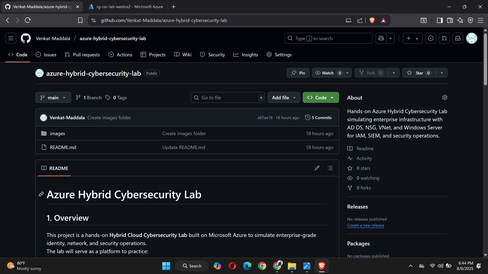
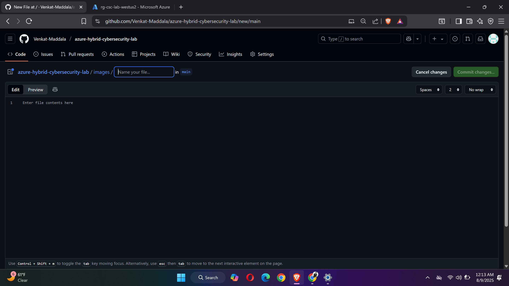

# Azure Hybrid Cybersecurity Lab

## 1. Overview
This project is a hands-on **Hybrid Cloud Cybersecurity Lab** built on Microsoft Azure to simulate enterprise-grade identity, network, and security operations.  
The lab will serve as a platform to practice:
- Active Directory setup and management
- Network segmentation and firewall rule configuration
- SIEM integration with Azure Sentinel & Splunk
- Identity Governance with SailPoint
- Vulnerability scanning and security monitoring

---

## 2. Lab Architecture (as of 08-Aug-2025)

**Region**: West US 2  
**Resource Group**: `rg-csc-lab-westus2`  

### Components Created Today:
| Resource Name | Type | Location | Notes |
|---------------|------|----------|-------|
| vnet-csc | Virtual Network | West US 2 | CIDR: 10.0.0.0/16 |
| subnet-dc | Subnet | West US 2 | CIDR: 10.0.1.0/24 |
| nsg-dc | Network Security Group | West US 2 | Inbound RDP (3389) allowed |
| DC01-ip | Public IP Address | West US 2 | Static |
| dc01635 | Network Interface | West US 2 | Linked to DC01 |
| DC01 | Virtual Machine (Windows Server) | West US 2 | Planned Domain Controller |

---

## 3. Network Diagram
*(Diagram Placeholder — to be added later)*

Example layout:

Internet
|
Public IP (DC01-ip)
|
NSG (nsg-dc)
|
Subnet (subnet-dc) — 10.0.1.0/24
|
Virtual Machine (DC01)

---

## 4. Step-by-Step Progress (08-Aug-2025)

1. Created **Resource Group** `rg-csc-lab` in East US *(later recreated in West US 2 for regional consistency)*.
2. Created **Virtual Network** `vnet-csc` with address space `10.0.0.0/16`.
3. Added **Subnet** `subnet-dc` with `10.0.1.0/24` CIDR.
4. Configured **Network Security Group** `nsg-dc`:
   - Allowed inbound RDP (TCP 3389) from my IP.
5. Created **Public IP** `DC01-ip` (Static).
6. Created **NIC** `dc01635` linked to `subnet-dc` & `nsg-dc`.
7. Deployed **Windows Server VM** `DC01` in West US 2:
   - Size optimized for Azure Education credits.
   - Monitoring features disabled to reduce cost.
8. Deleted unused **East US** resources after migration.

---

## 5. Configuration Notes
- **Security Type**: Standard
- **Public IP**: Static for consistent RDP connection
- **Monitoring**: All optional monitoring disabled to preserve credits
- **Cost Optimization**: Selected lowest viable VM size for DC role

---

## 6. Next Steps
- Promote `DC01` to Domain Controller and configure Active Directory.
- Add a client VM to join the domain.
- Set up Azure Sentinel for SIEM.
- Integrate Splunk for log management.
- Deploy SailPoint for Identity Governance testing.
- Implement vulnerability scanning tools (OpenVAS, Nessus, etc.).

---

## 7. Screenshots
## 7. Screenshots

1. **Create Resource Group - East US**  
   

2. **Create Virtual Network - West US 2**  
   

3. **Add Inbound Rules to NSG**  
   

4. **Create Network Security Group - West US 2**  
   

5. **VM Basics Tab (Part 1)**  
   

6. **VM Basics Tab (Part 2)**  
   .png)

7. **VM Networking Tab**  
   

8. **VM Management Tab**  
   

9. **VM Monitoring Tab**  
   

10. **VM Advanced Tab**  
    

11. **Resource Group - Move Options**  
    

12. **Moving Resources to New Resource Group**  
    

13. **Delete Old Resource Group - East US**  
    

14. **GitHub Repo Creation**  
    

15. **GitHub Images Folder**  
    

16. **Search - Resource Group**  
    

17. **Search - Network Security Group**  
    

18. **Search - Virtual Machine**  
    

19. **Search - Virtual Network**  
    

---

## 8. Credits
Built by **Venkat Maddala** as part of a personal cybersecurity skills development lab.  
This project is continuously evolving to replicate **real-world enterprise hybrid cloud environments**.

