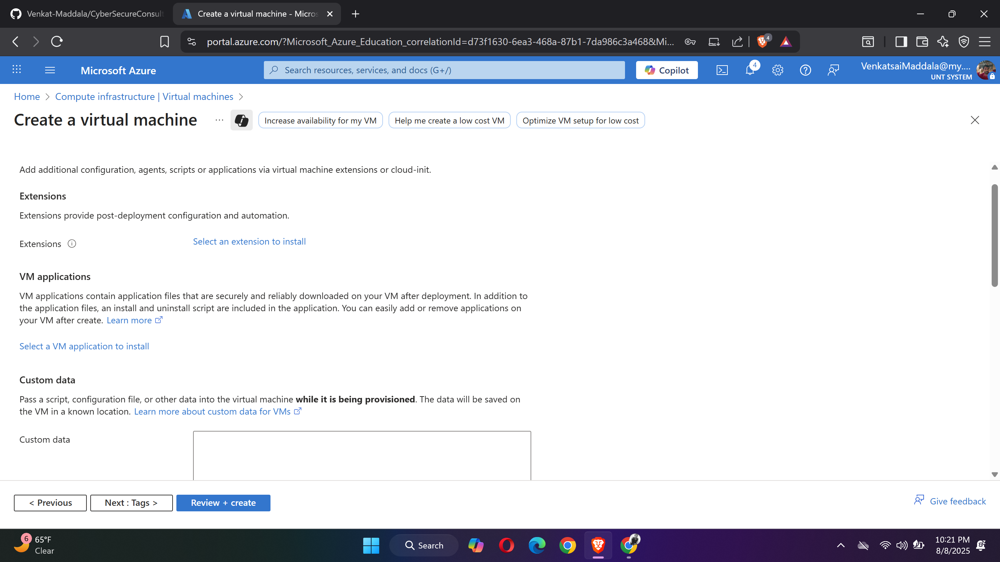

# Azure Hybrid Cybersecurity Lab

## 1. Overview
This project is a hands-on **Hybrid Cloud Cybersecurity Lab** built on Microsoft Azure to simulate enterprise-grade identity, network, and security operations.  
The lab will serve as a platform to practice:
- Active Directory setup and management
- Network segmentation and firewall rule configuration
- SIEM integration with Azure Sentinel & Splunk
- Identity Governance with SailPoint
- Vulnerability scanning and security monitoring

---

## 2. Lab Architecture (as of 08-Aug-2025)

**Region**: West US 2  
**Resource Group**: `rg-csc-lab-westus2`  

### Components Created Today:
| Resource Name | Type | Location | Notes |
|---------------|------|----------|-------|
| vnet-csc | Virtual Network | West US 2 | CIDR: 10.0.0.0/16 |
| subnet-dc | Subnet | West US 2 | CIDR: 10.0.1.0/24 |
| nsg-dc | Network Security Group | West US 2 | Inbound RDP (3389) allowed |
| DC01-ip | Public IP Address | West US 2 | Static |
| dc01635 | Network Interface | West US 2 | Linked to DC01 |
| DC01 | Virtual Machine (Windows Server) | West US 2 | Planned Domain Controller |

---

## 3. Network Diagram

```mermaid
flowchart TB
  Internet[(Internet)] --> PIP["Public IP: DC01-ip"]
  PIP --> NSG["NSG: nsg-dc"]

  subgraph Azure["Azure — West US 2"]
    subgraph VNET["vnet-csc 10.0.0.0/16"]
      subgraph SUBNET_DC["subnet-dc 10.0.1.0/24"]
        DC01["DC01 - Windows Server 2022"]
      end
      subgraph SUBNET_CLIENTS["subnet-clients 10.0.2.0/24"]
        CLIENT01["CLIENT01 - Windows 10"]
      end
      subgraph SUBNET_SEC["subnet-security 10.0.3.0/24"]
        SIEM["siem01 - Splunk / Azure Sentinel"]
      end
    end
  end

  NSG --> DC01
  DC01 -- "DNS/Kerberos" --> CLIENT01
  CLIENT01 -- "Syslog/Agent" --> SIEM

```

Example layout:

Internet
|
Public IP (DC01-ip)
|
NSG (nsg-dc)
|
Subnet (subnet-dc) — 10.0.1.0/24
|
Virtual Machine (DC01)

---

## 4. Step-by-Step Progress 

  ### **Update – 08 Aug 2025**
  
  1. Created **Resource Group** `rg-csc-lab` in East US *(later recreated in West US 2 for regional consistency)*.
  2. Created **Virtual Network** `vnet-csc` with address space `10.0.0.0/16`.
  3. Added **Subnet** `subnet-dc` with `10.0.1.0/24` CIDR.
  4. Configured **Network Security Group** `nsg-dc`:
     - Allowed inbound RDP (TCP 3389) from my IP.
  5. Created **Public IP** `DC01-ip` (Static).
  6. Created **NIC** `dc01635` linked to `subnet-dc` & `nsg-dc`.
  7. Deployed **Windows Server VM** `DC01` in West US 2:
     - Size optimized for Azure Education credits.
     - Monitoring features disabled to reduce cost.
  8. Deleted unused **East US** resources after migration.
  
  ### **Update – 10 Aug 2025**
  
  1. Created **Organizational Units (OUs)** for better AD structure:
    - `_Servers`
    - `_Workstations`
    - `_Users`
      - `Admins`
      - `StandardUsers`
  2. Moved **CLIENT01** into `_Workstations` OU.
  3. Created test domain user **Harry Potter** in `StandardUsers`.
  4. Attempted **GPO deployment** for desktop wallpaper *(requires shared UNC path for completion)*.
  5. Noted RDP restriction for new users — pending group membership fix.

  ### **Update – 15 Aug 2025**

- **Case Study:** Added `case-studies/gpo-wallpaper-case-study/` with a full README and a `/Screenshots` folder.  
  - Root cause documented: **RDP client was configured to suppress desktop backgrounds**; enabling **Desktop background** in the RDP Experience settings revealed the GPO-applied wallpaper.
  - Included resolution steps (SYSVOL path, permissions, loopback merge) and verification (`gpupdate`, `gpresult`).
  - Added an “MMC Crash (mmc.exe 0x8007000e)” fix snippet (clear `%APPDATA%\Microsoft\MMC` and GP History).
- **Screenshots:** Linked ZIP and inline images:
  - `case-studies/gpo-wallpaper-case-study/Screenshots/Desktop-wallpaper-GPO.zip`
  - Updated README to embed `GPMC.png`, `GPMCeditor.png`, `GPO-Report-AppliedGPOs.png`, `RDP-exp-tab.png`, `VMviaRDP-Display-Settings.png`, `eventviewer-DC01.png`.
- **Network Diagram:** Replaced placeholder with a **Mermaid** diagram (vertical layout for clarity).
- **Ops hygiene:** Set **DC01 time zone** to **Central Standard Time**; confirmed **Auto-shutdown 11:59 PM Central** for DC01 and CLIENT01.
- **Progress Tracker:** Locked phases 1–5 as complete; **Phase 6** marked as *in progress* (screenshots upload pending).

### **Update – 16 Aug 2025**

- **Microsoft Sentinel (Phase 7 kickoff):**
  - Verified/created **Log Analytics Workspace** `law-csc` (West US 2), retention set for lab use.
  - **Enabled Microsoft Sentinel** on `law-csc` (free trial activated).
  - **Windows Security Events via AMA:** Created **DCR `DCR-WindowsSecurity`**, scoped to **DC01** and **CLIENT01**; **Azure Monitor Agent** deployed and showing **Succeeded** on both VMs.
  - **Data flow verified:** `SecurityEvent` table receiving data.
  - **Hunting:** Ran KQL to isolate **failed logons (4625)** from **CLIENT01** and confirmed results.
- **Next actions (planned):**
  - Enable **Entra ID** diagnostics (**SignInLogs**, **AuditLogs**) to `law-csc`.
  - Create a **scheduled analytics rule** for multiple failed logons in 10 minutes (brute-force signal).
  - Save a **Windows Security** workbook and capture screenshots for the case study.
### **Update – 17 Aug 2025**

- **Microsoft Sentinel onboarding (Windows Security via AMA):**
  - Verified/created **Log Analytics Workspace** `law-csc` (West US 2) and set retention.
  - Enabled **Microsoft Sentinel** on `law-csc` (trial active).
  - Installed **Windows Security Events via AMA** connector:
    - Created **DCR** `DCR-WindowsSecurity` scoped to **DC01** and **CLIENT01**.
    - Confirmed **Azure Monitor Agent** installed (Extensions → *Succeeded*).
  - **KQL**: validated ingestion from `SecurityEvent`, tested **4625 failed logons**, and saved queries.
  - **Analytics rule** created: **≥5 failed logons in 10 minutes** with entity mapping (Account→`Target`, Host→`Computer`).
  - Note: Some Sentinel blades redirect to **Defender portal** (expected).
  - Decision: **Entra ID (SignIn/Audit) deferred** due to university tenant permissions.
- 📂 Case study scaffold created: `case-studies/sentinel-onboarding/`

### **Update – 18 Aug 2025**

- **Alert grouping enabled** on the brute-force rule: *Group when all entities match* (**Account + Host**, **15 min** window).
- **Incidents verified** in **Defender → Incidents & alerts → Incidents** for brute-force tests (against `CSCLAB\hpotter`).
- **Workbook saved**: *Windows Security – Event Analyzer* to workspace `law-csc`; set to **Last 24 hours** and validated charts.
- **Case study finalized**:
  - Completed `case-studies/sentinel-onboarding/README.md` with **mind map**, **KQL**, and **evidence**.
  - Added screenshots (connector, DCR, AMA on VMs, KQL results, rule summary, incidents, workbook).
- 🔗 Added/verified repo link:  
  - [Microsoft Sentinel — Onboarding](case-studies/sentinel-onboarding/Readme.md)

### **Update - 19 Aug 2025**

-   Started extending the existing playbook `pbk-EmailOnNewIncident`.\
-   Goal: integrate **Azure DevOps Work Item creation** into the SOC
    workflow.\
-   Created PAT in DevOps (scope: Work Items -- Read & Write).\
-   Stored PAT securely in **Azure Key Vault**, assigned Logic App MI →
    `Key Vault Secrets User`.

### **Update - 20 Aug 2025**

-   Inserted **Get Secret** action into playbook to fetch PAT.\
-   Added **Compose WorkItem Title/Description** actions with dynamic
    Sentinel fields.\
-   Configured **HTTP action** to call Azure DevOps REST API using PAT.\
-   Debugged **Authorization expression** → fixed with
    `concat('Basic ', base64(concat(':', body('Get_secret')?['value'])))`.\
-   First DevOps work item successfully created (#1).

### **Update - 21 Aug 2025**

-   Updated **Add Comment** action in Sentinel incident → auto-inserts
    DevOps work item link.\
-   Updated **Send Email (V2)** action → added DevOps work item link.\
-   Issue: email rendered raw HTML → fixed by forcing `IsHtml=true` in
    code view.\
-   Verified end-to-end flow with test incident.

### **Update - 22 Aug 2025**

-   Encountered issue: test analytics rule (`SecurityEvent | take 1`)
    produced no incidents (VMs off).\
-   Fixed by using **dummy query**: `print test="ForceTestRow"` in
    Analytics Rule.\
-   Created **Automation Rule** (new method) to trigger playbook on
    incident creation.\
-   Successfully generated test incidents that triggered playbook.

### **Update - 23 Aug 2025**

-   Full E2E validation: Sentinel Incident → Playbook run → DevOps Issue
    created → Sentinel Comment updated → Email sent with clickable
    links.\
-   Captured evidence screenshots (Logic App run, DevOps issue, email).\
-   Discussed **future backlog**: Simulated L1 assignment (Harry Potter,
    Ron Weasley, etc.) using tags/variables.\
-   Closed phase with working SOC-style ITSM automation.

---
## 5. Configuration Notes
- **Security Type**: Standard
- **Public IP**: Static for consistent RDP connection
- **Monitoring**: All optional monitoring disabled to preserve credits
- **Cost Optimization**: Selected lowest viable VM size for DC role

---

## 6. Next Steps
- Promote `DC01` to Domain Controller and configure Active Directory.
- Add a client VM to join the domain.
- Set up Azure Sentinel for SIEM.
- Integrate Splunk for log management.
- Deploy SailPoint for Identity Governance testing.
- Implement vulnerability scanning tools (OpenVAS, Nessus, etc.).

---
## 7. 📂 Case Studies
- [GPO Desktop Wallpaper Deployment – Case Study](case-studies/gpo-wallpaper-case-study/README.md)
---

## 8. Screenshots

1. **Search - Resource Group**  
    
   
2. **Create Resource Group - East US**  
   

3. **Search - Virtual Network**  
    
    
4. **Create Virtual Network - West US 2**  
   

5. **Search - Network Security Group**  
    
    
6. **Create Network Security Group - West US 2**  
   

7.**Add Inbound Rules to NSG**  
   
   
8.**Search - Virtual Machine**  
    
    
9.  **VM Basics Tab (Part 1)**  
   

10. **VM Basics Tab (Part 2)**  
   .png)

11. **VM Networking Tab**  
   

12. **VM Management Tab**  
   

13. **VM Monitoring Tab**  
   

14. **VM Advanced Tab**  
    

15. **Resource Group - Move Options**  
    

16. **Moving Resources to New Resource Group**  
    

17. **Delete Old Resource Group - East US**  
    

---

## 8. Credits
Built by **Venkat Maddala** as part of a personal cybersecurity skills development lab.  
This project is continuously evolving to replicate **real-world enterprise hybrid cloud environments**.

