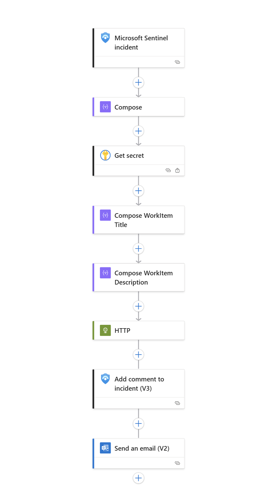

## Phase: ITSM Simulation -- Sentinel to DevOps Work Item (pbk-EmailOnNewIncident)

**Objective:**\
Simulate a real SOC workflow where new Sentinel incidents automatically
create **DevOps work items**, add context in Sentinel, and notify
analysts via email.

### 🔹 Architecture

-   **Trigger:** Sentinel playbook (`pbk-EmailOnNewIncident`) fires
    **When Incident is Created**.\
-   **Secrets:** DevOps Personal Access Token (PAT) stored securely in
    **Azure Key Vault**. Logic App retrieves it using Managed Identity +
    RBAC.\
-   **Actions:**
    1.  **Compose** → Extract incident ARM ID, Title, Description.\
    2.  **HTTP (Azure DevOps REST API)** → Create new **Issue** in
        project `CSC-SOC-WorkItems`.\
    3.  **Comment (Sentinel)** → Append DevOps work item link to the
        incident timeline.\
    4.  **Send Email (Office 365)** → Deliver incident summary + DevOps
        link to SOC distribution list.

### 🔹 Key Fixes & Lessons Learned

-   **PAT & RBAC:**
    -   Azure RBAC roles apply to Key Vault only, not DevOps.\
    -   DevOps requires the PAT's user to be a **Basic + Contributor**
        in the project.\
-   **HTTP Auth Expression:** Needed to base64 encode `:<PAT>` correctly
    via Key Vault.\
-   **HTML Email:** Default email body sent raw HTML. Fixed by
    explicitly setting `IsHtml=true` and cleaning up the Body block.\
-   **Testing:** Created a custom **Analytics Rule** with query
    `print test="ForceTestRow"` to generate incidents without relying on
    lab VMs (DC01/Client01).

### 🔹 Outcome

-   **Fully automated flow:** Sentinel → DevOps → SOC email.\
-   **Work items include:** Incident title, description, severity,
    status, workspace, ARM ID, and direct Sentinel link.\
-   **End-user experience:** Analysts receive actionable email with a
    **clickable DevOps work item link** and see the same link in
    Sentinel comments.
---
## FlowChart

   
---
### 🔹 Next Steps (Backlog)

-   **L1 Assignment Simulation:** Current issues are unassigned. Future
    enhancement: rotate simulated SOC analysts (Harry Potter, Ron
    Weasley, etc.) via tags/variables.\
-   **Custom Fields:** Add "Simulated Assignee" field in DevOps work
    items for portfolio realism.\
-   **Automation Rules Cleanup:** Retire the dummy `print` query once
    real log sources (DC01/Client01) are generating consistent
    SecurityEvents.
